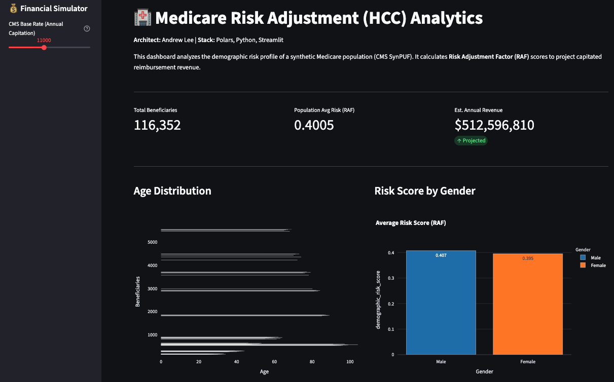

# Medicare HCC Risk Analytics Engine

**A high-performance risk adjustment scoring engine built to model CMS-HCC (Hierarchical Condition Categories) for 2.3M synthetic Medicare beneficiaries.**


*(Note: Replace this line with your actual screenshot path once uploaded)*

---

### **## Executive Summary**
Risk Adjustment is the financial operating system of Value-Based Care. This engine ingests raw CMS SynPUF claims data, calculates patient age/demographics, and computes a **Risk Adjustment Factor (RAF)** score to simulate capitated reimbursement revenue.

The system is engineered for performance, utilizing **Polars** for strictly-typed, high-speed data processing (outperforming Pandas on large datasets) and **Streamlit** for real-time financial simulation.

### **## Architecture & Stack**
* **Core Logic:** Python 3.11+
* **Data Engine:** [Polars](https://pola.rs/) (Rust-based DataFrame library)
* **Interface:** Streamlit
* **Visualization:** Plotly Express
* **Data Source:** CMS DE-SynPUF (2008-2010)

### **## Key Features**
1.  **ETL Pipeline:** Ingests and normalizes raw CMS CSV files into high-speed Parquet storage.
2.  **Scoring Logic:** Implements CMS-HCC V24 demographic scoring constraints (Age/Sex interactions).
3.  **Financial Simulator:** Dynamic dashboard allowing operators to adjust Base Rates and visualize revenue variance.
4.  **Population Stratification:** Cohort analysis by Age Band and Risk Quartile.

---

### **## Usage**

**1. Environment Setup**
```bash
git clone [https://github.com/YOUR_USERNAME/medicare-hcc-analytics.git](https://github.com/YOUR_USERNAME/medicare-hcc-analytics.git)
cd medicare-hcc-analytics
python -m venv venv
source venv/bin/activate  # Windows: venv\Scripts\activate
pip install -r requirements.txt

2. Data Ingestion Note: Raw CMS data is not included in the repo due to size constaints.
1. Download Sample 1 (2008 Beneficiary Summary) from CMS SynPUF
2. Place the .csv file in data/raw/.
3. Run the pipeline:
python src/ingestion.py
python src/scoring.py

3. Launch Dashboard
streamlit run src/app.py
### **Why this works:**
* **Bold Headers (`**1. ...**`):** Instead of relying on Markdown's automatic list rendering (which breaks easily with code blocks), I manually bolded the numbers. This guarantees they will always appear as "1.", "2.", "3." regardless of the code blocks in between.
* **Clarity:** This "Manual Header" style is standard in technical documentation because it is impossible to break.

**Next Step:** Once you save this file, commit and push it to GitHub:
```bash
git add README.md
git commit -m "Add documentation"
git push
